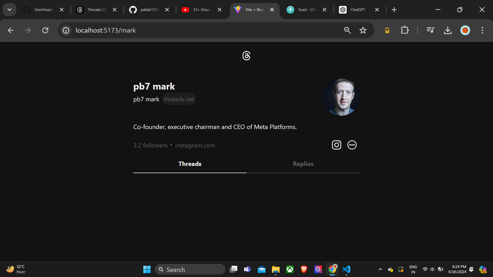
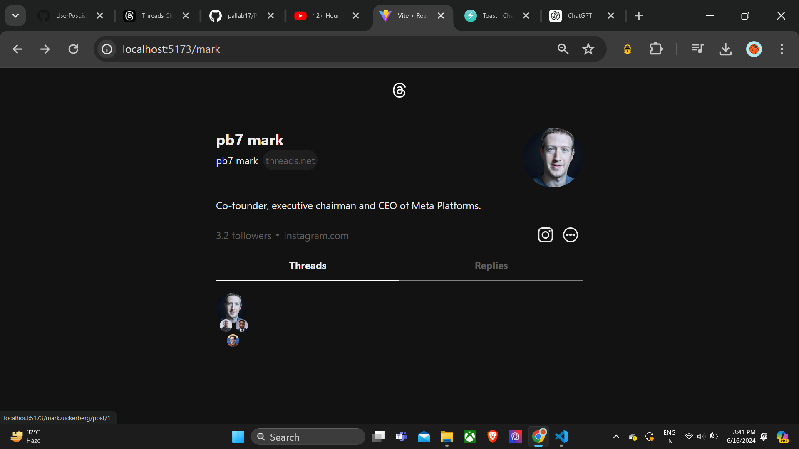
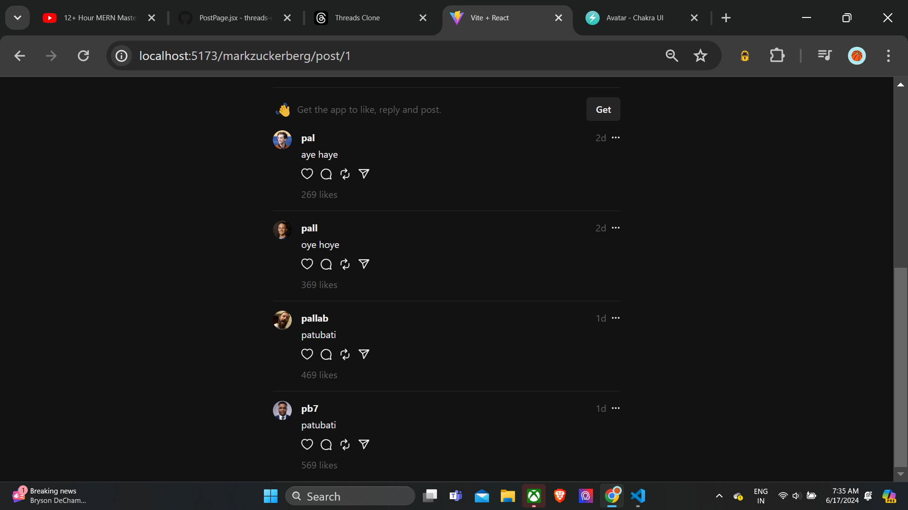
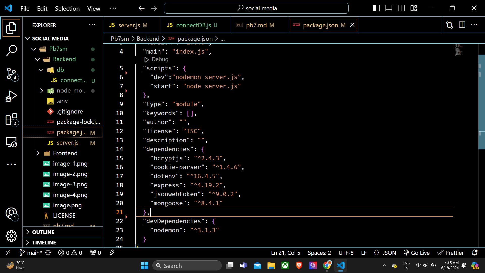
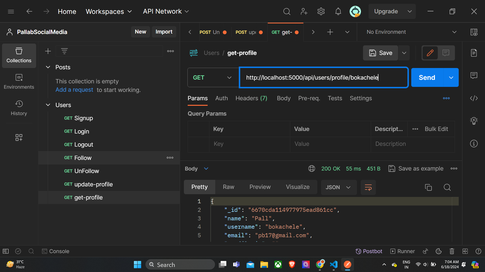
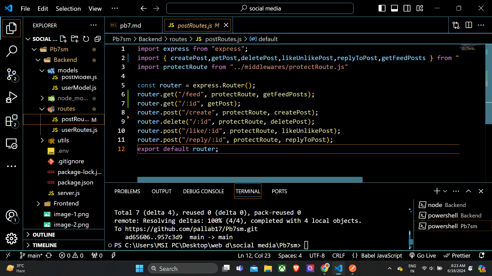
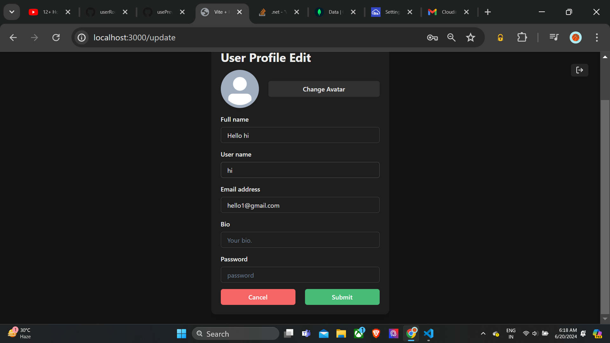

/*
chakra ui addition
chakra ui testing using button provided by chaakra ui
react-router dom addition
user page post-page addition
public folder e pic addition from github of as a programmer
dark mode,light mode banalam
 --> user pg r userheader section ta banalam
 left column of post banalam
 whole post component banalam
same post e dynamic data i.e. different likes comments r data diye 4-5 ta post korlam

 --> single post pg banachi
 ==> comment section banalam

frontend r kaj sesh!

backend suru-
 eiguno install korlam

tarpor server start korlam
env file banalam port no dhokalam

database r jonno mongod atlas website e giye notun ekta new database create korlam
tarpor mongo_uri tune anlam ene env te tule rakhlam

tarpor
connectDB.js file likhe db r sathe connection r code likhlam

tarpor db connected msg elo

tarpor usermodel.js aar postmodel.js schema file banalam

tarpor middleware guno likhlam

tarpor route guno

route guno lekhar jonno we need controller to make it look clean

signup r jonno controller lekhar por

amra postman e giye signup api test kore elam

tarpor amra token aar cookie banalam

login r jonno controller lekhar por

amra postman e giye login api test kore elam

logout r jonno controller lekhar por

amra postman e giye logout api test kore elam

amra jokhun follow/unfollow route lekhar time e we remembered that we have to create a protectRoute r middleware because ekta manus ke follow korte gele amake age login hote hobe

follow/unfollow r jonno controller lekhar por

amra postman e giye follow/unfollow api test kore elam

same for update route 

same for getUserProfile route 

userRoutes r jonno total 6 ta route banalam --> 

-->postRoutes r jonno total 6 ta route banalam

connecting frontend + backend

prothome login aar signup page ta banachi 

to toggle between the two we are using import { useSetRecoilState } from "recoil";

atom + recoilroot
authatom(only for login/signup pg) + useratom(user r state r jonno using local storage)

authpage.jsx for authentication 

updateprofile pg    eitate dp change korar jonno we are using usePreviewImg.jsx tarpor ei updated dp take cloudinary te store korchi
prothome backend r server e giye cloudinary ke input korlam

tarpor userroutes r mooodhe update fn e giye cloudinary te recent dp ta store korar fn likhlam
oha backend r env file e cloudinary r details store kore rekhechi

*/